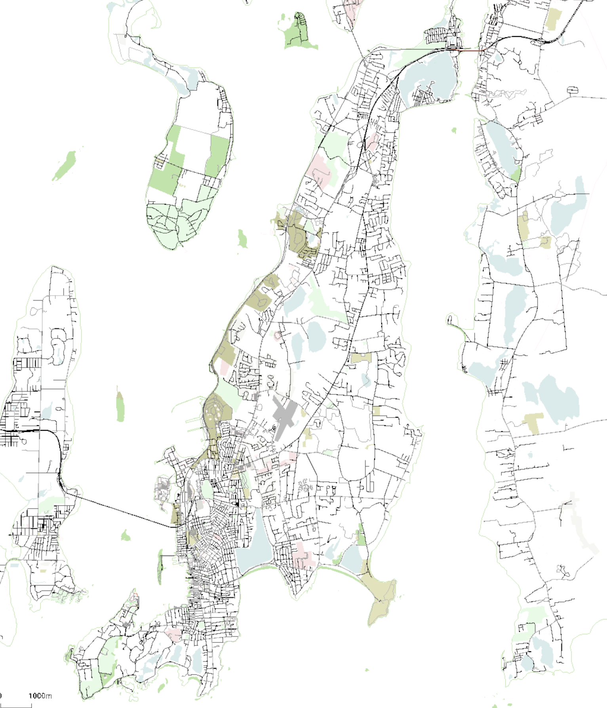

# SUMO Model of Aquidneck Island
This repository contains a network model around Aquidneck Island for use in [SUMO](https://sumo.dlr.de/wiki/Simulation_of_Urban_MObility_-_Wiki) simulations.



  This work is licensed under a [Creative Commons Attribution-ShareAlike 4.0 International License](http://creativecommons.org/licenses/by-sa/4.0/).

This code base is designed to allow customization of the SUMO network based on OpenStreetMap data, in such a way that it can be reconstituted from scratch using `netconvert`.

## Mapping Workflow

1. Obtain source data
Download the OpenStreetMap data from overpass by navigating to [https://overpass-api.de/api/map?bbox=-71.4022,41.4471,-71.1742,41.6578
](https://overpass-api.de/api/map?bbox=-71.4022,41.4471,-71.1742,41.6578
) in a browser.
2. Run netconvert
Run `netconvert -c netconvert_configuration.netc.cfg`
3. Extract polygons
  Run `polyconvert -c polyconvert_configuration.cfg.xml` to create the polygon file.

As much as possible should be included by editing either the OpenStreetMap database (for errors or clarifications, following the [contribution guidelines](https://wiki.openstreetmap.org/wiki/Good_practice)) or in the [netconvert configuration file](netconvert_configuration.netc.cfg) to tweak how the source data is translated.

### Tracking network changes

Network patch files are generated using the `netdiff.py` tool included with SUMO.  Tool documentation is [here](https://sumo.dlr.de/docs/Tools/Net.html#netdiffpy).  To rebuild the model using new baseline data:
```
netconvert --sumo-net-file baseline.net.xml -n patches\aquidneck_island_diff.nod.xml -e patches\aquidneck_island_diff.edg.xml -x patches\aquidneck_island_diff.con.xml -i patches\aquidneck_island_diff.tll.xml -o aquidneck_island.net.xml
```

Run the `netdiff.py` tool to update the patch files in the `patches/` directory prior to merging any network changes into the `master` branch.


## Running a Simulation
A sample simulation can be built using the `newport_neighborhoods.xml` traffic assignment zones and `OD2TRIPS`. Build the trip configuration file by calling `OD2TRIPS -c baseline_trip_config.cfg.xml`.  Then run `baseline_sim_config.sumocfg` in SUMO or SUMO-GUI.

### Using Docker
From this folder, run ```docker run -it --name aquidneck --mount type=bind,source="$(pwd),target=/model paulopperman/sumo-docker:latest```
